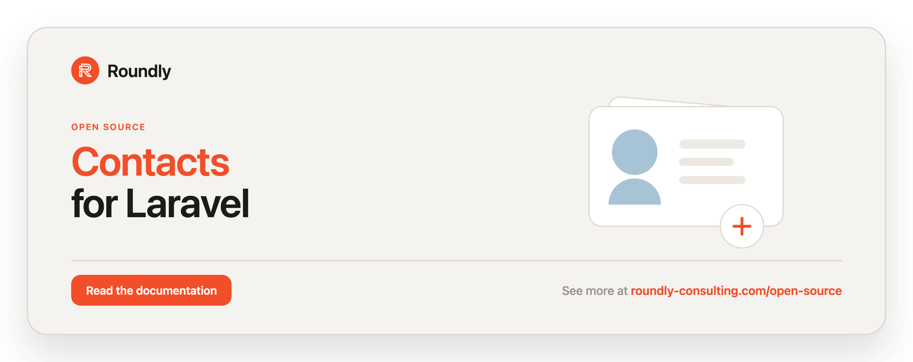

<!-- roundly-hero:start -->
<p align="center">
  <a href="https://roundly-consulting.com/open-source/docs/contacts-for-laravel?utm_source=github&utm_medium=readme&utm_campaign=open-source&utm_content=contacts-for-laravel">
    
  </a>
</p>
<!-- roundly-hero:end -->

<!-- roundly-badges:start -->
<p align="center">
  <a href="https://packagist.org/packages/roundly-consulting/contacts-for-laravel"></a>
  <a href="https://github.com/roundly-consulting/contacts-for-laravel/actions/workflows/run-tests.yml"></a>
  <a href="https://github.com/roundly-consulting/contacts-for-laravel/actions/workflows/fix-php-code-style-issues.yml"></a>
  <a href="https://donate.stripe.com/dRmeVe8FX5PF1Qd9pXcEw00"></a>
  <a href="https://www.patreon.com/cw/roundly"></a>
  <a href="https://roundly-consulting.com/support-us?utm_source=github&utm_medium=readme&utm_campaign=open-source&utm_content=contacts-for-laravel#crypto"></a>
</p>
<!-- roundly-badges:end -->

# Contacts for Laravel

Typed, validated contacts for any Laravel model — emails, phones, addresses, URLs, social handles
and custom kinds on a user, company or order. Values are normalized before they are stored, every
owner keeps one primary per kind, and contacts can be verified with a code and exported as vCard.

## Installation

Requires PHP 8.4, Laravel 12 or 13.

```bash
composer require roundly-consulting/contacts-for-laravel
php artisan vendor:publish --tag="addresses-migrations"
php artisan vendor:publish --tag="connections-migrations"
php artisan vendor:publish --tag="contacts-migrations"
php artisan migrate
```

If your owner models have UUID/ULID keys, set `CONTACTS_KEY_TYPE` **before** migrating.

## Usage

Add `HasContacts` to any model:

```php
use RoundlyConsulting\Contacts\Concerns\HasContacts;

class User extends Model
{
    use HasContacts;
}
```

Add, read and export contacts through the facade:

```php
use RoundlyConsulting\Contacts\Enums\ContactType;
use RoundlyConsulting\Contacts\Facades\Contacts;

Contacts::for($user)->email(' A.Person@Example.COM ')->label('Work')->primary()->add();
Contacts::for($user)->phone('+421 900 000 000')->label('Mobile')->add();

Contacts::for($user)->primary(ContactType::Email)?->value;   // 'a.person@example.com'
Contacts::for($user)->ofType(ContactType::Phone);              // ordered by position
Contacts::for($user)->vCard();                                 // a vCard 3.0 string
```

Verify a contact — the package issues the code, your app delivers it:

```php
use RoundlyConsulting\Contacts\Events\ContactVerificationRequested;

Event::listen(function (ContactVerificationRequested $event): void {
    // send $event->plainToken to $event->contact->value by SMS or mail
});

$phone = Contacts::for($user)->primary(ContactType::Phone);

Contacts::verification()->request($phone);          // a 6-digit code, stored only as a hash
Contacts::verification()->confirm($phone, $code);   // sets verified_at, or throws
```

<!-- roundly-docs:start -->
## Documentation

The full documentation — configuration, every feature and its API, and testing — lives on our
website: **[roundly-consulting.com/open-source/docs/contacts-for-laravel](https://roundly-consulting.com/open-source/docs/contacts-for-laravel?utm_source=github&utm_medium=readme&utm_campaign=open-source&utm_content=contacts-for-laravel)**

Release notes are in [CHANGELOG.md](CHANGELOG.md). To contribute, see the
[contributing guide](https://github.com/roundly-consulting/.github/blob/main/CONTRIBUTING.md).
<!-- roundly-docs:end -->

<!-- roundly-support:start -->
## Support our work

This package is free and open source, built and maintained by
[Roundly Consulting](https://roundly-consulting.com/open-source?utm_source=github&utm_medium=readme&utm_campaign=open-source&utm_content=contacts-for-laravel).
If it saves you time, please consider supporting our open-source work — a one-time donation, a
monthly pledge on Patreon or a crypto donation helps fund maintenance, new features and new
packages.

<a href="https://donate.stripe.com/dRmeVe8FX5PF1Qd9pXcEw00"></a>
<a href="https://www.patreon.com/cw/roundly"></a>
<a href="https://roundly-consulting.com/support-us?utm_source=github&utm_medium=readme&utm_campaign=open-source&utm_content=contacts-for-laravel#crypto"></a>
<!-- roundly-support:end -->

## License

The MIT License (MIT). See [LICENSE.md](LICENSE.md) for details.
